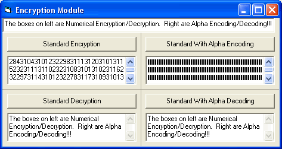



## \_ Unique way of Encryption / Encoding

### Description

A very unique way to encrypt a string. You can have it return ALL numbers and the encrypted string or Alpha Encode it, which will return unreadable characters. See Screen Shot. Please vote!!!!
 
### More Info
 

             |
---                |---
**Submitted On**   |2003-11-23 03:16:14
**By**             |[KRYO\_11](https://github.com/Planet-Source-Code/PSCIndex/blob/master/ByAuthor/kryo-11.md)
**Level**          |Intermediate
**User Rating**    |4.8 (63 globes from 13 users)
**Compatibility**  |VB 5\.0, VB 6\.0
**Category**       |[Encryption](https://github.com/Planet-Source-Code/PSCIndex/blob/master/ByCategory/encryption__1-48.md)
**World**          |[Visual Basic](https://github.com/Planet-Source-Code/PSCIndex/blob/master/ByWorld/visual-basic.md)
**Archive File**   |[\_\_Unique\_w16752611232003\.zip](https://github.com/Planet-Source-Code/kryo-11-unique-way-of-encryption-encoding__1-50066/archive/master.zip)

